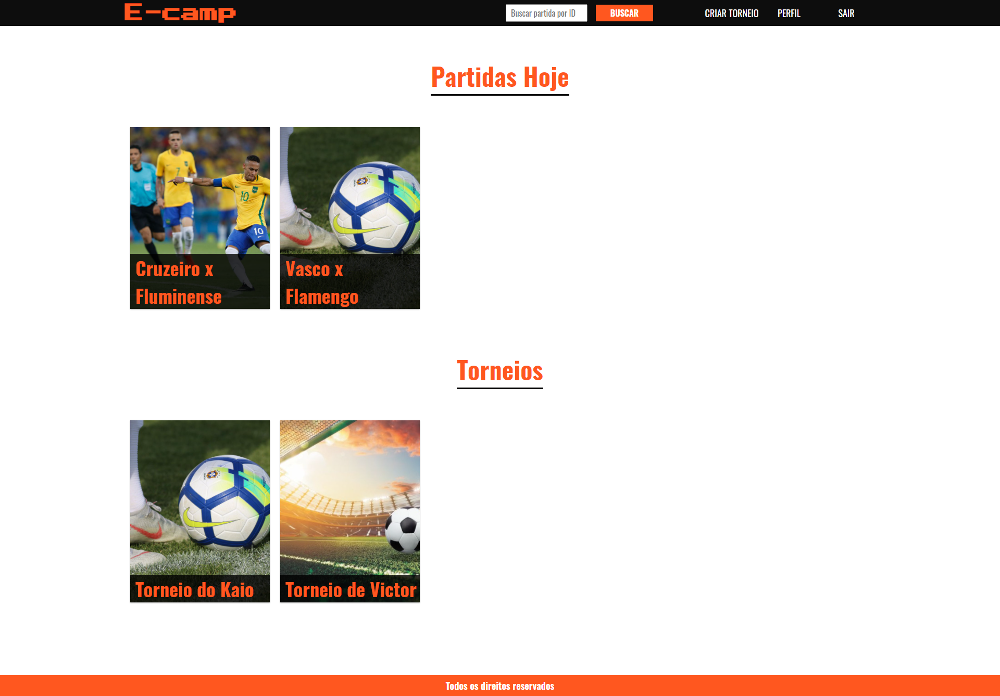
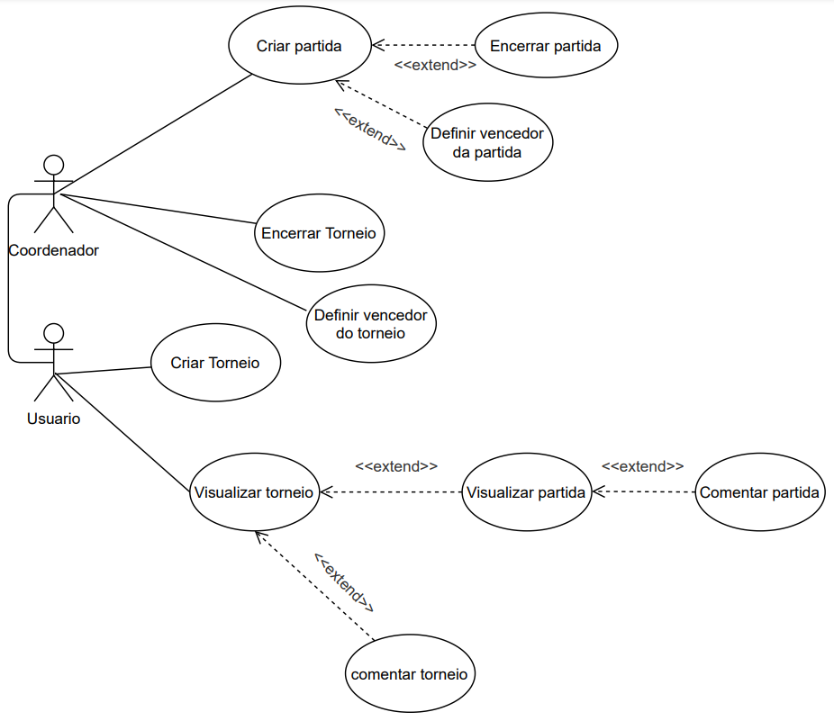
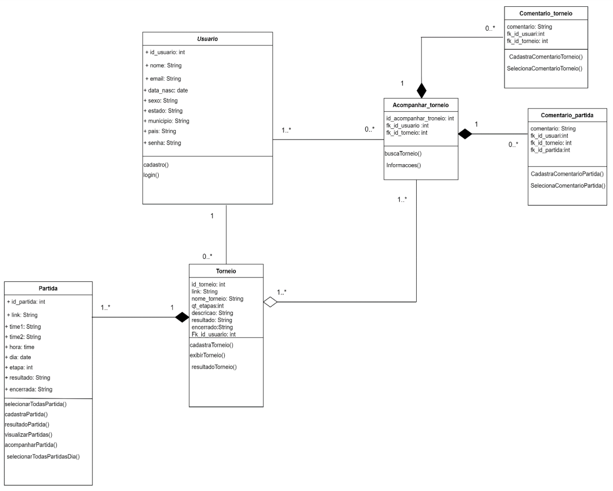
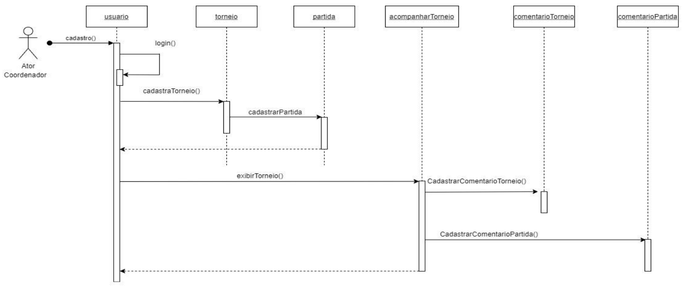
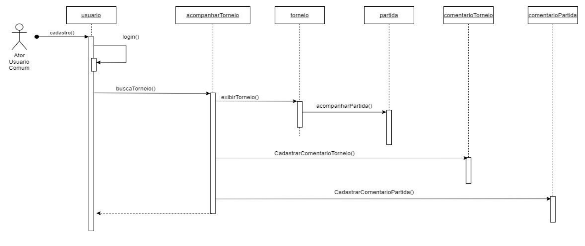
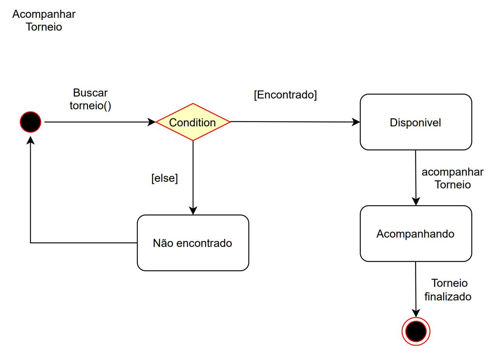
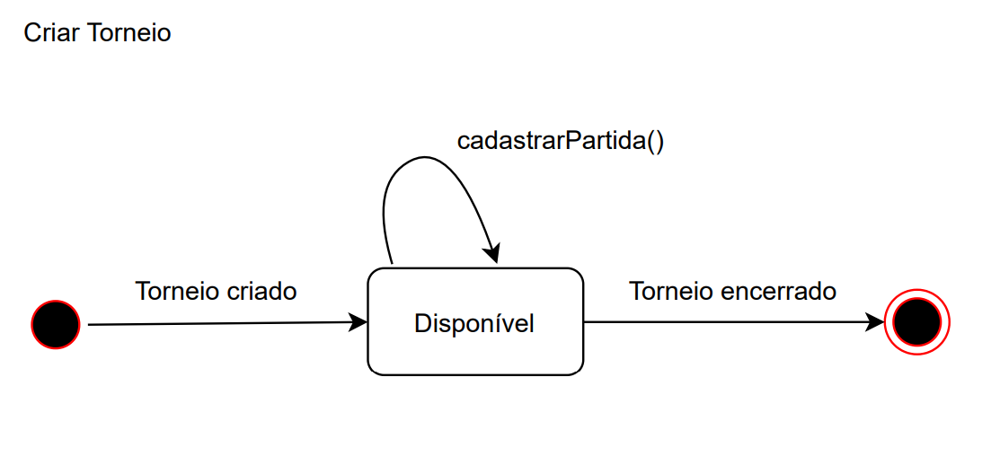

  <h1 align="center">E-Camp</h1>

## Sobre o Projeto
Projeto desenvolvido pelos alunos Cayo Roberto, Kaio Yukio, , Rodolfo Rivelino e Victor Maya para disciplina de Projeto e Desenvolvimento de Software, do curso de Engenharia da Computação, da Universidade Federal do Maranhão, ministrada pelo Prof. Dr.Davi Viana dos Santos.

  

 

### Proposta: site de genrenciamento de campeonatos
- Contém o gerenciamento de campeonatos;
- É possivel acompanhar seus campeonatos preferidos/partidas preferidas;
- Qualquer um pode criar seu próprio campeonato, não importa a dimensão.
- Se logado você poderá comentar nos campeonatos e nas partidas.

### Tecnologias
* [JavaScript](https://www.javascript.com/)
* [ReactJS](https://reactjs.org)
* [NodeJS](https://nodejs.org/en/)
* [Express](https://expressjs.com/pt-br/)
* [MySQL](https://www.mysql.com/)

### Diagramas feitos durante o desenvolvimento do projeto

#### Diagrama de caso de uso

  

 

#### Diagrama de classe

  

 

#### Diagramas de sequência 

  

 

  

 

#### Diagramas de estados

  

 

  

 
